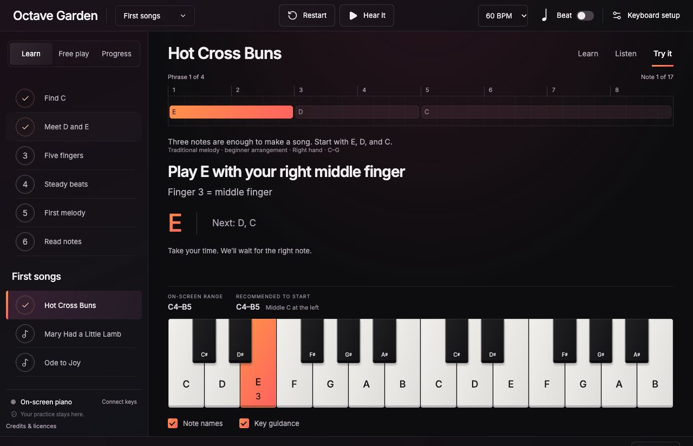

# Octave Garden

**Grow into piano, one key at a time.**

A local piano-learning studio for complete beginners. Connect a MIDI keyboard or
use the on-screen keys, hear a sampled grand piano, and work through short lessons
and familiar melodies at your own pace. No accounts, subscriptions or telemetry.



**Status: active experiment · v0.1.0.** Chrome on macOS is the initial target.
One LUMI Keys has been used successfully for Bluetooth input and piano sound.
**Physical key lighting is experimental and did not work reliably on the tested
Bluetooth connection.** On-screen guidance works independently. See
[verification and known limitations](docs/verification.md).

## Start playing

Install **Node.js 22.13+ (22.x) or 24+**, then run these commands from this folder:

```sh
npm ci
npm run dev
```

Open **[localhost:5184](http://localhost:5184)** and click **Enable piano**.
You can immediately try a lesson with the on-screen keyboard.

The server binds to localhost only. Keep the same address and port to retain
saved browser progress. Installation needs internet; practice uses bundled
lessons, fonts and piano samples. A local server must remain running—this is not
an installable PWA or a native macOS app.

For a production build:

```sh
npm run build
npm start
```

Stop the development server before `npm start`; both use port 5184.

## What you can learn

- Six lessons: finding C, D and E, five-finger C–G practice, steady beats, an
  original melody, and introductory treble-staff reading.
- Seven beginner songs: **Hot Cross Buns**, **Mary Had a Little Lamb**,
  **Ode to Joy**, **Au clair de la lune**, **Lightly Row**, **Jingle Bells**, and
  **When the Saints Go Marching In**. Some use shortened themes or simplified rhythms.
- **Learn → Listen → Try it** stages, note names, finger suggestions and a
  keyboard that highlights the next note.
- Untimed practice that waits for a fresh correct press, plus adjustable rhythm
  practice starting at 60 BPM.
- **Play** mode: falling notes, timed hits, streaks and local best scores for all
  seven songs, with a four-beat count-in and adjustable speed.
- Free play, demonstration playback, a metronome, volume and local progress.

See [song notes](docs/song-notes.md) for arrangement scope and references.

All initial lessons and songs fit on one 24-key LUMI. The software supports up to
two inputs, but two-device hardware acceptance remains unverified. Finger numbers
are suggestions; MIDI does not tell the app which finger you used. Untimed song
practice checks note order, not how long each note was held.

## Play a song game

The sidebar is the main navigation: each mode shows its own lessons, songs or
options below the mode tabs. Choose **Play**, pick a song from the sidebar,
then press **Start song**. On small screens, open the navigation menu to choose
a mode and song. Choosing a different song stops the current round. Notes fall toward matching piano keys. Press when the
bottom edge reaches the glowing line. Play uses the same calibrated keyboard
range and key sizing as Learn and Free play. Start at 40–60 BPM and raise the speed as
you get comfortable. Use the LUMI, tap the on-screen keys, or play **A S D F G**
for C D E F G. Release between repeated notes.

Perfect timing earns 100 points; a nearby hit earns 70. Misses and extra presses
break your streak. Note length is a visual guide; scoring checks the start of the
note, not how long you hold it. Best scores are saved per song and speed, separately
from lesson completion. Games pause on focus loss, keyboard setup or a MIDI
connection change; resume when ready. **All notes off** also pauses the game.
Use **Learn this song at your pace** to return to the untimed lesson.

Game guidance is on-screen. Experimental physical-key lighting is not enabled in
this mode. Bluetooth audio latency is especially noticeable in timed play; use
laptop speakers or wired headphones.

## Connect a LUMI on macOS

1. Turn on the keyboard and Bluetooth on your Mac.
2. Open **Audio MIDI Setup → Window → Show MIDI Studio**. In MIDI Studio, open
   **Bluetooth Configuration** and connect the LUMI. Use this MIDI window rather
   than ordinary Bluetooth accessory pairing.
3. Open **Keyboard setup** in Octave Garden and enable MIDI access. Select your
   input. Choose one connection per instrument to avoid duplicate USB/Bluetooth
   input.
4. Calibrate by pressing the lowest and highest physical keys. **C4–B5** puts
   middle C at the far left and is the recommended beginner range.
5. For experimental lighting, select the matching MIDI output and channel,
   then run **Test E light**. Confirm only if the intended key visibly changes
   for six seconds and returns to normal. Factory C markers do not count as a
   successful target-light test. Reconnection requires another test.

For two separately exposed inputs, use adjacent octave ranges and calibrate each.
For joined units exposed as one input, calibrate the ends of the whole keyboard.
Generic MIDI keyboards may work for note input; physical lighting is LUMI-specific
and is not promised for other devices.

See [ROLI's Bluetooth instructions](https://support.roli.com/en/support/solutions/articles/36000582346-how-to-connect-your-roli-device-to-your-computer-via-bluetooth).
This is an independent community experiment, not an official ROLI product.

## Sound, octaves and lights

Use laptop speakers or wired headphones; Bluetooth headphones add latency.
The LUMI arrow buttons change its octave. Recalibrate after using them. The app
shows the **calibrated range** and last received note; it cannot continuously read
the keyboard's octave setting. An app-only octave adjustment can move the sound
into a comfortable range without changing the keyboard configuration.

If sound seems wrong, use **Play sound check** to hear fixed middle C, E and G.
**Restart piano** rebuilds the audio engine without deleting progress. Notes
outside the acoustic range A0–C8 are silent and produce a range warning.

Two resting C lights can be factory markers. The lighting experiment uses ordinary
MIDI notes and per-key pressure based on the
[published factory-program source](https://github.com/benob/LUMI-lights/blob/master/littlefoot/LUMI%20Keys%20Block%20Default%20Program.littlefoot).
It does not install a custom program, flash firmware or request SysEx access.
A successful MIDI send is not proof of an illuminated key. If the E test fails,
leave physical guidance unverified and continue with on-screen guidance.

## Privacy and local data

Lessons, samples and fonts are bundled locally. There is no backend, analytics,
recording, account or remote runtime API. Progress, preferences and device
selections live in browser local storage, with at most 100 practice summaries.
Game best scores use the separate `octave-garden.game.v1` storage key.
Clearing site data removes them; there is currently no export or cloud sync.

The fixed localhost origin and original `first-notes.v1` storage key are retained
from the prototype so existing users keep their progress after the rename.

## Development

```sh
npm test            # unit and hook tests with simulated MIDI/audio
npm run build       # regenerate notices, check TypeScript and build
npm run check       # tests and production build
npm run notices     # refresh bundled dependency licence notices
```

GitHub Actions runs the checks on Node 22 and 24. The application package is marked
`private` to prevent accidental npm publishing; its source is open under MIT.

See [CONTRIBUTING.md](CONTRIBUTING.md) for the code layout and contribution guide,
[verification](docs/verification.md) for evidence and open hardware checks, and
[publishing instructions](docs/publishing.md) for the initial GitHub push.

Near-term work: reliable factory-program light guidance, two-keyboard acceptance,
and accessibility/device testing. Song imports, recording, AI tutoring and
advanced two-hand courses are outside the current scope.

## Licence and credits

App code and authored lesson arrangements: [MIT](LICENSE).
Third-party assets retain their own licences:

- **Salamander Grand Piano** by Alexander Holm: CC BY 3.0, distributed via
  Tone.js. [Sample attribution](public/samples/ATTRIBUTION.md).
- **Inter** by the Inter Project Authors: SIL Open Font License 1.1.
- React, Tone.js, Lucide and their runtime dependencies: individual notices in
  [THIRD_PARTY_NOTICES.txt](public/THIRD_PARTY_NOTICES.txt).

[Credits and complete notices](public/credits.html) are also bundled in the running
app. The songs are simplified, newly entered arrangements of traditional or
historical melodies; no commercial recordings or lyrics are included.
